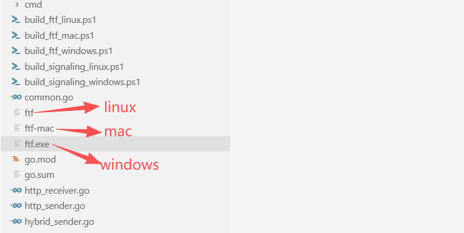
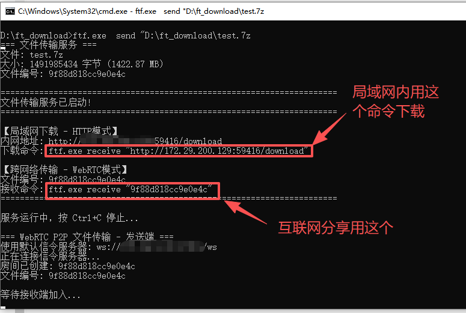
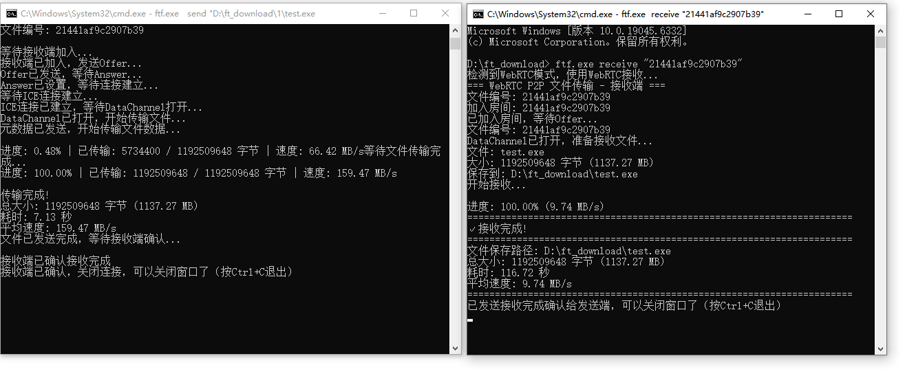

# 免费文件传输工具（支持跨网络传输）

由于工作中经常需要传输文件，于是就制作了这个文件传输小工具，开始的想法是基于浏览器实现，但是发现基于浏览器的WebRTC传输速度实在有限，对速度没有要求的伙伴也欢迎尝试使用，本文最后有介绍

## Golang 命令行版

使用非常简单，支持HTTP 局域网直接下载，WebRTC 跨网络直接传输。打包后的可执行文件已上传仓库，可以直接运行，也可以用源码里的build_xxx.ps1自行打包




#### 发送文件和接收文件

`ftf.exe  send "D:\ft_download\test.7z"`

`ftf.exe receive "9f88d818cc9e0e4c"`





## 浏览器版

地址：https://filetsf.online/   (域名正在备案，请先使用下面的IP 访问)

```
https://175.24.2.28/
```

```
访问口令：filetsf
```

#### 如果感觉有用请打赏一杯咖啡，(PS买服务器让这个服务一直可用)


